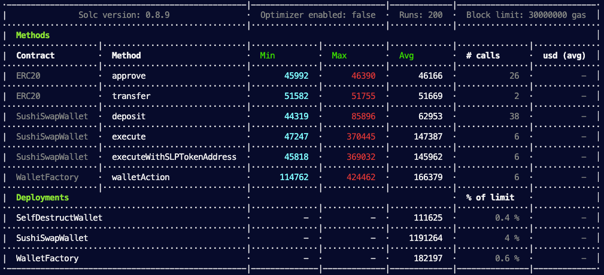

# RatherLabs Challenge

## Outcome

SushiSwap liquidity program usually takes 5 transactions:

    1. Approve token 1
    2. Approve token 2
    3. Add liquidity
    4. Approve SLP token
    5. Deposit SLP token

This is a process very expensive taking around 498136 wei to be completed:

| Method            | Gas Used |
| ----------------- | -------- |
| Approve Token 1   | 46354    |
| Approve Token 2   | 46354    |
| Add Liquidity     | 171417   |
| Approve Token SLP | 46166    |
| Deposit           | 187845   |
| Total             | 498136   |

Table generated with sushiswap process simulation:
`npx hardhat report`

To improve this process we can compress it in a single transaction.
Using `execute` in [SushiSwapWallet.sol](contracts/SushiSwapWallet.sol) we can save around **70.51 %** of gas cost. It uses an average gas of 147,387.

SushiSwap use a library to calculate SLP tokens addresses, the same that is used in the previous method, but we can calculate it off-chain and send it as parameter to avoid extra calls to the library as is done in the method `executeWithSLPTokenAddress` found in [SushiSwapWallet.sol](contracts/SushiSwapWallet.sol). Using this method we can save around **71%** of gas cost. It uses an average gas of 145,962.

Both of these methods are very efficient, but they have some disadvantages. The more significant is that these methods require to deposit your tokens inside a smart contract. It means, that in any moment we would have to execute two transactions to deposit our tokens:

1. to approve our tokens [approve](https://docs.openzeppelin.com/contracts/2.x/api/token/erc20#IERC20-approve-address-uint256-)
2. to deposit tokens [deposit](contracts/SushiSwapWallet.sol)

Another fact that usually is not considered is how users get their tokens.
The most common process is to transfer tokens from a centralized exchange to a crypto wallet. Once the tokens are in the crypto wallet, users start to interact with smart contracts. This implies that users have to execute and pay one transaction more.


To solve this problem we can use a contract that destroys itself each time it is executed such as [SelfDestructWallet](contracts/SelfDestructWallet.sol).
[SelfDestructWallet](contracts/SelfDestructWallet.sol). It executes Sushiswap liquidity program flow and when it ends the contract is destroyed. To execute this contract we use a [WalletFactory](contracts/WalletFactory.sol) that deploys one instance of [SelfDestructWallet](contracts/SelfDestructWallet.sol) each time an user want to deposit their tokens. To deploy the wallet, [WalletFactory.sol](contracts/WalletFactory.sol) uses [CREATE2 opcode](https://eips.ethereum.org/EIPS/eip-1014) allowing to generate a unique address for each user for each pool he wants to deposit their tokens.
Using this pattern is more expensive than te previous methods due to the deployment of a wallet each time a user executes the actions. It takes 166,379 wei gas costs to execute, saving around 5% less than the previous methods, but still saving **66.75%** gas cost against sushiswap process.

Nevertheless, using this pattern give use an huge amount of advantages:

- We can calculate the resulting address off-chain. There is not need of make any transaction util user wants to apply in the liquidity program, allowing users to save their tokens in that address even if they have no executed the wallet creation.
- We don't have to save data in storage because the contract is self destructed.
- [CREATE2 opcode](https://eips.ethereum.org/EIPS/eip-1014) uses three parameters to calculate the address, address of executor (WalletFactory), salt(sender address), and bytecode(bytecode of [SelfDestructWallet](contracts/SelfDestructWallet.sol)). It means that the address can be accessed if it is not by our factory executed for the same user.
- We don't have to worry about security because the address doesn't have code.
- User can save their tokens in that address because only he can deploy contracts in that address
- User can transfer their tokens from any exchange or wallet to that address avoiding to use [approve](https://docs.openzeppelin.com/contracts/2.x/api/token/erc20#IERC20-approve-address-uint256-) or fall in transfer tokens from exchange to wallet, wallet to contract.
- Users can know their balance in their balance in their SelfDestructWallet in any system supporting [ERC20 standard](https://docs.openzeppelin.com/contracts/4.x/erc20).



Report generated with `npx hardhat test`

## Running Project

1. Open terminal and clone github project

```
    https://github.com/Diego-c22/RatherLabsChallenge.git
    cd RatherLabsChallenge
```

2. Install packages

```
    npm install
```

3. Set environment

- Create .env file in the root directory
  ```
    touch .env
  ```
- Copy content from .env-example and fill the environment variables

```
API_KEY_SCAN=
URL_RPC_TESTNET=
DEPLOYER_WALLET_PRIVATE_KEY=
URL_RPC_LOCAL=
URL_RPC_MAINNET=
ALCHEMY_KEY=
```

`API_KEY_SCAN` OPTIONAL. Block explorer key. Required to verify contracts.

`URL_RPC_TESTNET` OPTIONAL. Required to deploy and interact with contracts in testnet network.

`URL_RPC_LOCAL` OPTIONAL. Required to deploy and interact with contracts in local network.

`URL_RPC_MAINNET` OPTIONAL. Required to deploy and interact with contracts in mainnet network.
`DEPLOYER_WALLET_PRIVATE_KEY` OPTIONAL. Required to deploy and interact with contracts outside of hardhat network (local, testnet, mainnet).

`ALCHEMY_KEY` REQUIRED. Alchemy key for Ethereum Mainnet Network. Required to fork mainnet network. If you do not have an account use the next key:

```
ALCHEMY_KEY=EJLlMf9dNveQsv_r8QNUeNedMXOb2XtA
```

4. Sync SushiSwap Liquidity Pools

```
npx hardhat sync
```

NOTE: This command execute a task that retrieve all the liquidity pool stored in MasterChefV1 and MasterChefV2 and save them in a json file. This is just for testing propose, in a real environment Liquidity Pools must be stored in a data base with a event listener that detects when a new pool has been created to ensure data is always up to date.

5. Run tests

- Running all tests

  ```
  npx hardhat test
  ```

- Running unit tests

  ```
  npx hardhat test test/unit
  ```

- Running integration tests

  ```
  npx hardhat test test/integration
  ```

Available Commands:

```shell
npx hardhat check
npx hardhat clean
npx hardhat compile
npx hardhat coverage
npx hardhat docgen
npx hardhat flatten
npx hardhat help
npx hardhat test
npx hardhat node
npx hardhat sync
npx hardhat verify
npx hardhat report
```

# Solidity API

## WalletFactory

### Deployed

```solidity
event Deployed(address address_)
```

### walletAction

```solidity
function walletAction(bytes bytecode) public
```

Execute function to deploy contract executing sushiswap flow in predicted address.

_This function use create2 opcode to deploy the contract in a address that could be predicted.
The salt is calculated with the address of the sender making impossible to create a contract in this
address if it is not deployed from this factory and triggered by the same sender._

#### Parameters

| Name     | Type  | Description                                                                                          |
| -------- | ----- | ---------------------------------------------------------------------------------------------------- |
| bytecode | bytes | Bytecode of smart contract to execute sushiswap flow concatenated with encoded constructor arguments |

## InsufficientBalance

```solidity
error InsufficientBalance()
```

## SushiSwapWallet

### ROUTER

```solidity
address ROUTER
```

### MASTER_CHEF

```solidity
address MASTER_CHEF
```

### MASTER_CHEF_V2

```solidity
address MASTER_CHEF_V2
```

### FACTORY

```solidity
address FACTORY
```

### balances

```solidity
mapping(address => mapping(address => uint256)) balances
```

### deposit

```solidity
function deposit(address token_, uint256 amount_) external payable
```

Allow add funds to user wallet.

_To use native currency set token_ as address(0).
When native currency is used, amount* is ignored and is taken msg.value.*

#### Parameters

| Name     | Type    | Description                  |
| -------- | ------- | ---------------------------- |
| token\_  | address | Address of token to deposit. |
| amount\_ | uint256 | Amount of tokens to deposit. |

### execute

```solidity
function execute(address token1, address token2, uint256 amount1, uint256 amount2, uint256 pid, address to) external
```

Execute SushiSwap deposit SLP tokens flow.

1.  Approve token 1 to SushiSwapRouter contract.
2.  Approve token 2 to SushiSwapRouter contract.
3.  AddLiquidity to pool.
4.  Approve SLP token to MasterChef contract.
5.  Deposit tokens.

_If 'to' is different to address(0) it will be used MasterChefV2._

#### Parameters

| Name    | Type    | Description                                                     |
| ------- | ------- | --------------------------------------------------------------- |
| token1  | address | Address of first token in the liquidity pool.                   |
| token2  | address | Address of second token in the liquidity pool.                  |
| amount1 | uint256 | Amount of tokens desired for first token in the liquidity pool. |
| amount2 | uint256 |                                                                 |
| pid     | uint256 | PID of liquidity pool.                                          |
| to      | address | Address to use as depositor                                     |

### executeWithSLPTokenAddress

```solidity
function executeWithSLPTokenAddress(address token1, address token2, uint256 amount1, uint256 amount2, uint256 pid, address token, address to) external
```

Execute SushiSwap deposit SLP tokens flow. - Use this function when SLP token address is calculated off-chain to save gas.

1.  Approve token 1 to SushiSwapRouter contract.
2.  Approve token 2 to SushiSwapRouter contract.
3.  AddLiquidity to pool.
4.  Approve SLP token to MasterChef contract.
5.  Deposit tokens.

- @dev If 'to' is different to address(0) it will be used MasterChefV2.

#### Parameters

| Name    | Type    | Description                                                     |
| ------- | ------- | --------------------------------------------------------------- |
| token1  | address | Address of first token in the liquidity pool.                   |
| token2  | address | Address of second token in the liquidity pool.                  |
| amount1 | uint256 | Amount of tokens desired for first token in the liquidity pool. |
| amount2 | uint256 |                                                                 |
| pid     | uint256 | PID of liquidity pool.                                          |
| token   | address | SLP token address.                                              |
| to      | address | Address to use as depositor                                     |

### \_checkBalance

```solidity
function _checkBalance(address token, uint256 amount) internal view
```

Verify if user has enough balance.

#### Parameters

| Name   | Type    | Description                               |
| ------ | ------- | ----------------------------------------- |
| token  | address | Address of token to check.                |
| amount | uint256 | Minimum amount of tokens expected to own. |

### \_addLiquidity

```solidity
function _addLiquidity(address token1, address token2, uint256 amount1, uint256 amount2) internal
```

Add liquidity to SushiSwap liquidity pool.

1.  Approve token 1 to SushiSwapRouter contract.
2.  Approve token 2 to SushiSwapRouter contract.
3.  AddLiquidity to pool.

#### Parameters

| Name    | Type    | Description                                                     |
| ------- | ------- | --------------------------------------------------------------- |
| token1  | address | Address of first token in the liquidity pool.                   |
| token2  | address | Address of second token in the liquidity pool.                  |
| amount1 | uint256 | Amount of tokens desired for first token in the liquidity pool. |
| amount2 | uint256 |                                                                 |

### \_deposit

```solidity
function _deposit(address token, uint256 pid, address to) internal
```

Deposit SLP tokens in SushiSwap MasterChef.

1.  Approve SLP token to MasterChef contract.
2.  Deposit tokens.

#### Parameters

| Name  | Type    | Description            |
| ----- | ------- | ---------------------- |
| token | address | SLP token address      |
| pid   | uint256 | PID of liquidity pool. |
| to    | address |                        |

## IMasterChef

### UserInfo

```solidity
struct UserInfo {
uint256 amount;
uint256 rewardDebt;
}
```

### PoolInfo

```solidity
struct PoolInfo {
address lpToken;
uint256 allocPoint;
uint256 lastRewardBlock;
uint256 accSushiPerShare;
}
```

### totalAllocPoint

```solidity
function totalAllocPoint() external view returns (uint256)
```

### deposit

```solidity
function deposit(uint256 _pid, uint256 _amount) external
```

### deposit

```solidity
function deposit(uint256 _pid, uint256 _amount, address _to) external
```

### poolLength

```solidity
function poolLength() external view returns (uint256)
```

### lpToken

```solidity
function lpToken(uint256) external view returns (address)
```

### userInfo

```solidity
function userInfo(uint256 _pid, address _user) external view returns (struct IMasterChef.UserInfo)
```

### poolInfo

```solidity
function poolInfo(uint256 pid) external view returns (struct IMasterChef.PoolInfo)
```

## IUniswapV2Router01

### factory

```solidity
function factory() external pure returns (address)
```

### WETH

```solidity
function WETH() external pure returns (address)
```

### addLiquidity

```solidity
function addLiquidity(address tokenA, address tokenB, uint256 amountADesired, uint256 amountBDesired, uint256 amountAMin, uint256 amountBMin, address to, uint256 deadline) external returns (uint256 amountA, uint256 amountB, uint256 liquidity)
```

### addLiquidityETH

```solidity
function addLiquidityETH(address token, uint256 amountTokenDesired, uint256 amountTokenMin, uint256 amountETHMin, address to, uint256 deadline) external payable returns (uint256 amountToken, uint256 amountETH, uint256 liquidity)
```

### removeLiquidity

```solidity
function removeLiquidity(address tokenA, address tokenB, uint256 liquidity, uint256 amountAMin, uint256 amountBMin, address to, uint256 deadline) external returns (uint256 amountA, uint256 amountB)
```

### removeLiquidityETH

```solidity
function removeLiquidityETH(address token, uint256 liquidity, uint256 amountTokenMin, uint256 amountETHMin, address to, uint256 deadline) external returns (uint256 amountToken, uint256 amountETH)
```

### removeLiquidityWithPermit

```solidity
function removeLiquidityWithPermit(address tokenA, address tokenB, uint256 liquidity, uint256 amountAMin, uint256 amountBMin, address to, uint256 deadline, bool approveMax, uint8 v, bytes32 r, bytes32 s) external returns (uint256 amountA, uint256 amountB)
```

### removeLiquidityETHWithPermit

```solidity
function removeLiquidityETHWithPermit(address token, uint256 liquidity, uint256 amountTokenMin, uint256 amountETHMin, address to, uint256 deadline, bool approveMax, uint8 v, bytes32 r, bytes32 s) external returns (uint256 amountToken, uint256 amountETH)
```

### swapExactTokensForTokens

```solidity
function swapExactTokensForTokens(uint256 amountIn, uint256 amountOutMin, address[] path, address to, uint256 deadline) external returns (uint256[] amounts)
```

### swapTokensForExactTokens

```solidity
function swapTokensForExactTokens(uint256 amountOut, uint256 amountInMax, address[] path, address to, uint256 deadline) external returns (uint256[] amounts)
```

### swapExactETHForTokens

```solidity
function swapExactETHForTokens(uint256 amountOutMin, address[] path, address to, uint256 deadline) external payable returns (uint256[] amounts)
```

### swapTokensForExactETH

```solidity
function swapTokensForExactETH(uint256 amountOut, uint256 amountInMax, address[] path, address to, uint256 deadline) external returns (uint256[] amounts)
```

### swapExactTokensForETH

```solidity
function swapExactTokensForETH(uint256 amountIn, uint256 amountOutMin, address[] path, address to, uint256 deadline) external returns (uint256[] amounts)
```

### swapETHForExactTokens

```solidity
function swapETHForExactTokens(uint256 amountOut, address[] path, address to, uint256 deadline) external payable returns (uint256[] amounts)
```

### quote

```solidity
function quote(uint256 amountA, uint256 reserveA, uint256 reserveB) external pure returns (uint256 amountB)
```

### getAmountOut

```solidity
function getAmountOut(uint256 amountIn, uint256 reserveIn, uint256 reserveOut) external pure returns (uint256 amountOut)
```

### getAmountIn

```solidity
function getAmountIn(uint256 amountOut, uint256 reserveIn, uint256 reserveOut) external pure returns (uint256 amountIn)
```

### getAmountsOut

```solidity
function getAmountsOut(uint256 amountIn, address[] path) external view returns (uint256[] amounts)
```

### getAmountsIn

```solidity
function getAmountsIn(uint256 amountOut, address[] path) external view returns (uint256[] amounts)
```

## IUniswapV2Router02

### removeLiquidityETHSupportingFeeOnTransferTokens

```solidity
function removeLiquidityETHSupportingFeeOnTransferTokens(address token, uint256 liquidity, uint256 amountTokenMin, uint256 amountETHMin, address to, uint256 deadline) external returns (uint256 amountETH)
```

### removeLiquidityETHWithPermitSupportingFeeOnTransferTokens

```solidity
function removeLiquidityETHWithPermitSupportingFeeOnTransferTokens(address token, uint256 liquidity, uint256 amountTokenMin, uint256 amountETHMin, address to, uint256 deadline, bool approveMax, uint8 v, bytes32 r, bytes32 s) external returns (uint256 amountETH)
```

### swapExactTokensForTokensSupportingFeeOnTransferTokens

```solidity
function swapExactTokensForTokensSupportingFeeOnTransferTokens(uint256 amountIn, uint256 amountOutMin, address[] path, address to, uint256 deadline) external
```

### swapExactETHForTokensSupportingFeeOnTransferTokens

```solidity
function swapExactETHForTokensSupportingFeeOnTransferTokens(uint256 amountOutMin, address[] path, address to, uint256 deadline) external payable
```

### swapExactTokensForETHSupportingFeeOnTransferTokens

```solidity
function swapExactTokensForETHSupportingFeeOnTransferTokens(uint256 amountIn, uint256 amountOutMin, address[] path, address to, uint256 deadline) external
```

## UniswapV2Library

### sortTokens

```solidity
function sortTokens(address tokenA, address tokenB) internal pure returns (address token0, address token1)
```

### pairFor

```solidity
function pairFor(address factory, address tokenA, address tokenB) internal pure returns (address pair)
```

## IERC20Short

### approve

```solidity
function approve(address spender_, uint256 amount_) external
```

### balanceOf

```solidity
function balanceOf(address address_) external view returns (uint256)
```

## IUniswapV2Router

### addLiquidity

```solidity
function addLiquidity(address tokenA, address tokenB, uint256 amountADesired, uint256 amountBDesired, uint256 amountAMin, uint256 amountBMin, address to, uint256 deadline) external returns (uint256 amountA, uint256 amountB, uint256 liquidity)
```

## IChef

### deposit

```solidity
function deposit(uint256 _pid, uint256 _amount, address _to) external
```

## SelfDestructWallet

### ROUTER

```solidity
address ROUTER
```

### MASTER_CHEF

```solidity
address MASTER_CHEF
```

### FACTORY

```solidity
address FACTORY
```

### constructor

```solidity
constructor(address token1, address token2, uint256 pid, address token, address to) public
```

Execute SushiSwap deposit SLP tokens flow and at the end is self destructed.

1.  Approve token 1 to SushiSwapRouter contract.
2.  Approve token 2 to SushiSwapRouter contract.
3.  AddLiquidity to pool.
4.  Approve SLP token to MasterChef contract.
5.  Deposit tokens.

_If 'to' is different to address(0) it will be used MasterChefV2._

#### Parameters

| Name   | Type    | Description                                    |
| ------ | ------- | ---------------------------------------------- |
| token1 | address | Address of first token in the liquidity pool.  |
| token2 | address | Address of second token in the liquidity pool. |
| pid    | uint256 | PID of liquidity pool.                         |
| token  | address | SLP token address.                             |
| to     | address | Address to use as depositor                    |

## Token

### constructor

```solidity
constructor(string _name, string _symbol) public
```

```

```
